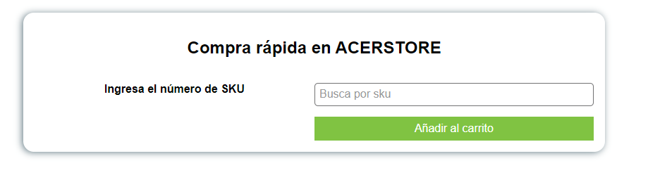

# Quick Order

Input que permitirá una compra rapida en mi sitio VTEX IO.

## Configuration 

### Paso 1: Clonar Proyecto

Clonar [este](https://github.com/kamivillabla/itgloberspartnercl-quick-order) repositorio en tu computador.

#### Paso 2 : Editar el Manifest.json

Una vez clonado el repositorio debe configurar el `Manifest.json` partiendo por: 
 - vendor
 - name
 - title
 - version
  
Ej: 

    "vendor": "itgloberspartnercl",
     "name": "quick-order",
     "version": "0.0.1",
     "title": "Compra rápida",
     "description": "Input que permitirá una compra rapida en mi sitio VTEX IO",

De igual manera debe configurar los archivos `package.json` con su `name` y `versión`

Comprobar que el proyecto cuenta con todas las builders y dependencias necesarias. Este proyecto funciona con: 

    "builders": {
      "react": "3.x",
      "messages": "1.x",
      "docs": "0.x",
      "store": "0.x"
    },  

    "dependencies": {
       "vtex.checkout-graphql": "0.x",
       "vtex.search-graphql": "0.x",
       "vtex.css-handles": "0.x"
    },

### Paso 3: Instalar node-modules

Por medio del terminal acceda a la carpeta `React` que se encuentra dentro de su repositorio por medio del comando `cd react` y ejecute el comando : `yarn install` el cual servira para instalar las dependencias necesarias. Una vez instalado vuelva al repositorio base con `cd ..`

### Paso 4: Ejecutar el Preview de la tienda.

En este paso se recomienda ejecutar `vtex whoami` para comprobar si se encuentra en su propio `workspace`.

Una vez listo ejecutar el comando `vtex link` dentro de la raiz de su proyecto. Este proceso instalara y vinculara nuestro app custom a nuestro proyecto base. Si no ocurre ningun error la consola mostrara el mensaje: `App linked successfully`

### Paso 5: Usar App custom en tienda base

Para usar esta app custom en su tienda base es importante importarla en su proyecto base dentro de las dependencias: 
Ej: vendor.name: version
  
    "dependencies": {
      "itgloberspartnercl.quick-order": "0.x"
     },

### Contributors

- Kamila Villablanca

